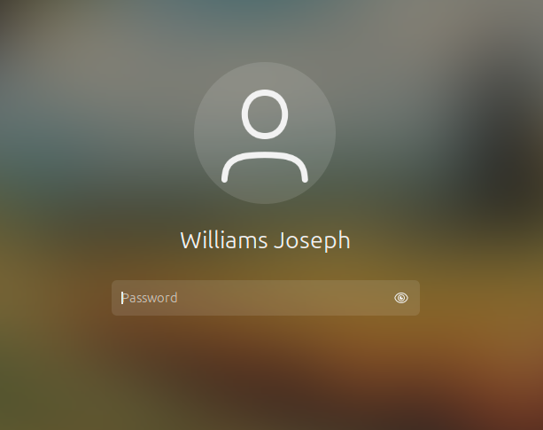
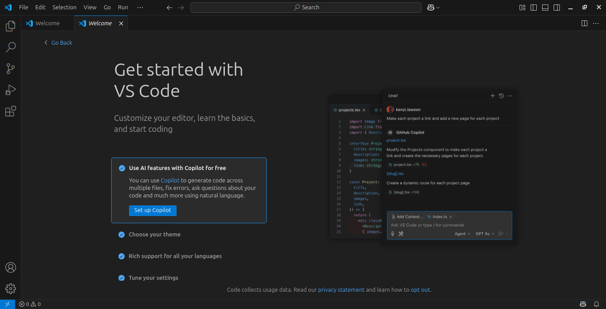
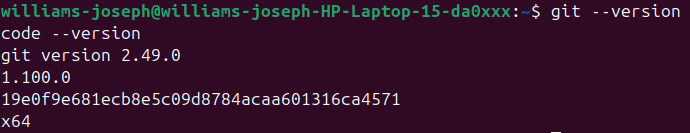
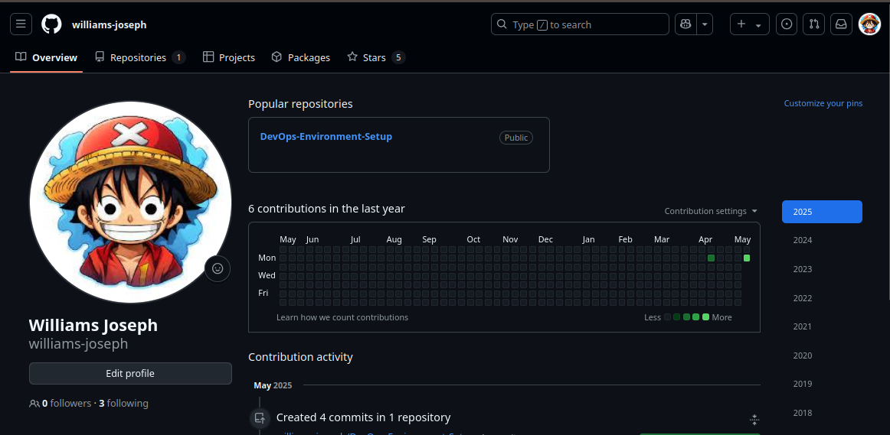

# DevOps Environment Setup (Ubuntu Host)

This is a step-by-step outline for the environment setup mini-project, which is part of the **first mini-project in Module 1** of the **DevOps learning track** under **3MTT Cohort 3**.

> **Note:** Unlike some setups that require installing Ubuntu inside VirtualBox on Windows, my laptop runs **Ubuntu as the primary operating system**. Therefore, I did not need to install VirtualBox or set up a virtual machine. All tools were installed directly on Ubuntu for better performance and simplicity.

---

## My Laptop's System Information 

- **Operating System**: Ubuntu 24.04.2 LTS (Codename: noble)  
- **RAM**: 8GB  
- **Processor**: Intel Core i3 (7th Generation)  
- **Architecture**: 64-bit  

*This is my Ubuntu running as the host OS, not inside a virtual machine.*

---

## Tools Installed

- **Visual Studio Code** – Code editor

*Installed Visual Studio Code as my text editor for writing and managing code.*

- **Git** – Version control

*Installed Git for version control.*

---

## Online Accounts

- [x] GitHub Account – Created and connected with Git

*Created a GitHub account to host repositories.*
  
- [x] AWS Account – Registered and ready

*Installed Git for version control.*

